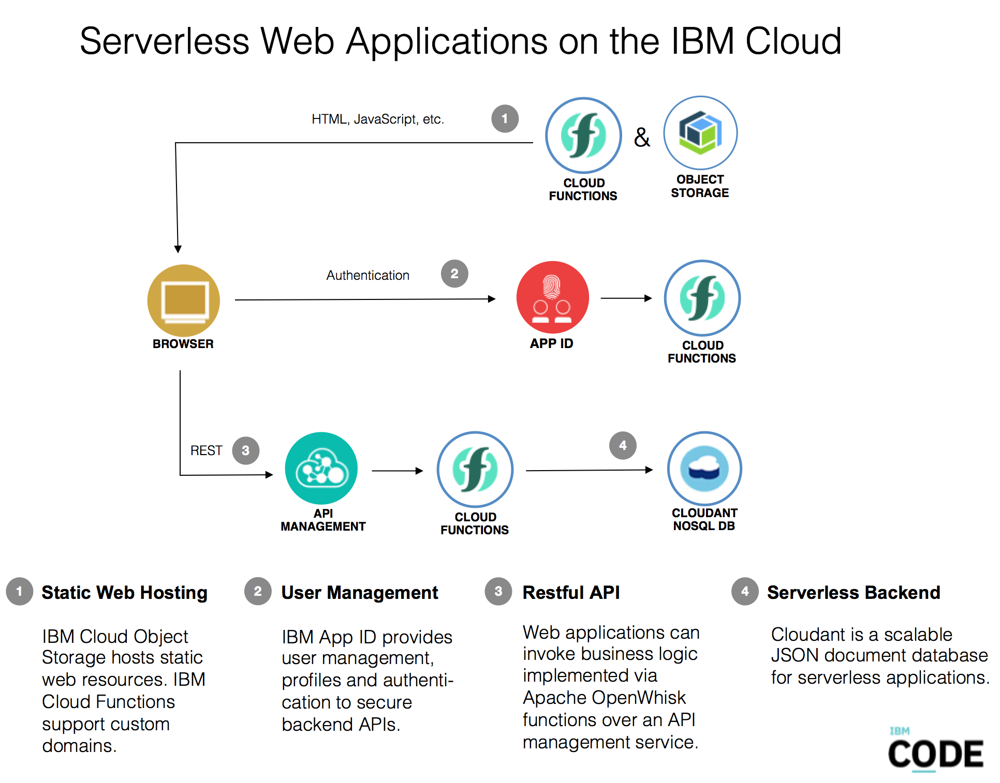

# Serverless Web Applications on the IBM Cloud

This repo explains how to build a serverless web application in the IBM Cloud. Static web resources are stored in IBM Object Storage, business logic is implemented via IBM Cloud Functions, authentication is handled via IBM App ID and data is stored in the managed NoSQL database IBM Cloudant.

The project contains two parts:

1) Sample web application built with Angular which requires user authentication to access data in Cloudant
2) Instructions how to build your own serverless web applications with potentially other JavaScript frameworks and other databases

This diagram shows the architecture with the main components:



Find out more about the main components:

* [IBM Cloud Functions](https://console.ng.bluemix.net/openwhisk) powered by Apache OpenWhisk
* [IBM Cloud Functions API Management](https://console.bluemix.net/openwhisk/apimanagement)
* [IBM Cloud Object Storage](https://console.bluemix.net/catalog/services/cloud-object-storage)
* [IBM App ID](https://console.bluemix.net/catalog/services/appid)
* [IBM Cloudant](https://console.ng.bluemix.net/catalog/services/cloudant-nosql-db)


## Setup

**Prerequisites**

Create an IBM Cloud lite account (free, no credit card required):

* [IBM Cloud account](https://ibm.biz/nheidloff)

Make sure you have the following tools installed:

* [git](https://git-scm.com/downloads)
* [ibmcloud CLI](https://console.bluemix.net/docs/cli/index.html)
* [Node](https://nodejs.org/en/download/)

**Terminal Setup**

```
$ git clone https://github.com/nheidloff/serverless-web-application-ibm-cloud.git
$ cd serverless-web-application-ibm-cloud
$ ibmcloud login
$ ibmcloud target --cf
$ ibmcloud iam api-key-create serverless-web-application \
  -d "serverless-web-application" \
  --file serverless-web-application.json
$ cp template.local.env local.env
$ cat serverless-web-application.json
```

In [local.env](local.env) define 'IBMCLOUD_API_KEY', 'IBMCLOUD_ORG', 'IBMCLOUD_SPACE' and 'BLUEMIX_REGION' to match the apikey in [serverless-web-application.json](serverless-web-application.json) and the org, space and region name that you're using (see the outputs in your terminal when following the steps above).


**to be continued**

